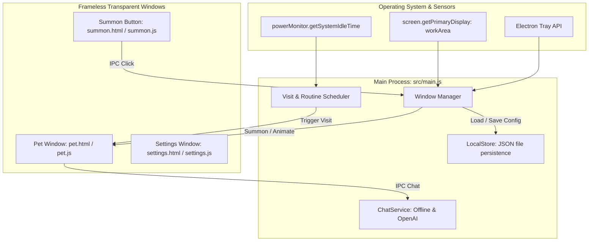

# Technical Implementation Documentation: Desktop AI Pet Companion (Batman Edition)

This document provides an in-depth technical explanation of the architecture, asset pipeline, animation mechanics, window management, scheduling engine, chat system, and persistence layer built for the **Nightwatch / Desktop AI Pet Companion**.

---

## 1. Architectural Overview

The application is built on **Electron** using a multi-window, decoupled architecture that isolates responsibilities between the operating system, UI rendering, and AI services.



### Windows Managed:
1. **Pet Window (`src/renderer/pet/`)**:
   - `transparent: true`, `frame: false`, `hasShadow: false`, `alwaysOnTop: true`, `skipTaskbar: true`.
   - Dimensions: 440px × 270px (holds pet + speech bubble + compact chat).
   - Anchored to the bottom-right corner of the primary display's workArea.
2. **Summon Button Window (`src/renderer/summon/`)**:
   - 64px × 64px floating circular avatar button.
   - Pinned to the screen edge, draggable, and clamped to screen boundaries.
3. **Settings Window (`src/renderer/settings/`)**:
   - 520px × 640px modal configuration interface for frequencies, pet size, sound, AI keys, and quiet hours.

---

## 2. Asset Pipeline & Background Removal

Source illustrations in `batman_images/` contained solid backgrounds, varying border dimensions, and third-party watermarks. A Python automation script ([`scripts/process_images.py`](file:///c:/Users/durga/Desktop/nightwatch/scripts/process_images.py)) was developed using **Pillow** and **NumPy**:

1. **Perimeter-Connected Flood-Fill**:
   - Instead of naive global color keying (which would accidentally hollow out Batman's white eyes, teeth, and halo), the script samples the perimeter borders and initiates a flood-fill from the outer boundary inwards:
     ```python
     for x in range(0, w, step):
         for y in [0, h - 1]:
             if im.getpixel((x, y))[3] > 0:
                 ImageDraw.floodfill(im, (x, y), (0, 0, 0, 0), thresh=thresh)
     ```
2. **Watermark & Header Cropping**:
   - `hello.jpg` included Pinterest headers and gray bars at the top and bottom. The script crops `(0, 200, 675, 990)` before transparency extraction.
3. **Inner Loop Enclosure Handling**:
   - The angel halo in `happy.jpg` forms a closed yellow ring. The script calculates the centroid of the halo ring and flood-fills the enclosed white loop:
     ```python
     yellow = (arr[:,:,0] > 200) & (arr[:,:,1] > 200) & (arr[:,:,2] < 150) & (arr[:,:,3] > 0)
     ys, xs = np.where(yellow)
     center_y, center_x = int(np.mean(ys)), int(np.mean(xs))
     ImageDraw.floodfill(cutout, (center_x, center_y), (0, 0, 0, 0), thresh=45)
     ```
4. **Sprite Mapping**:
   - `idle.png`: Watchful baseline pose.
   - `hydrate.png`: Wide-eyed reminder state.
   - `break.png`: Leaping pose for breaks and stretches.
   - `mood.png`: Flower bouquet for check-ins.
   - `celebrate.png`: Angel wings for task completion and streaks.
   - `escalate.png`: Disappointed face for 3+ snoozes.
   - `tray-icon.png` & `tray-icon.ico`: Multi-size desktop icons.

---

## 3. Character Animation Engine

The pet character is animated using a combination of CSS transforms and JavaScript state controllers in [`src/renderer/pet/pet.js`](file:///c:/Users/durga/Desktop/nightwatch/src/renderer/pet/pet.js):

1. **Idle Breathing (Squash & Stretch)**:
   - Subtle vertical compression and expansion to simulate organic breathing:
     ```css
     @keyframes petBreathe {
       0%, 100% { transform: scale(1, 1) translateY(0); }
       50% { transform: scale(1.025, 0.975) translateY(3px); }
     }
     ```
2. **Natural Blinking**:
   - An eyelid overlay layer (`.blink-layer`) placed over the eyes is toggled by JavaScript every ~4.2 seconds for 140ms.
3. **Waddling Walk Cycle**:
   - Walking uses alternating angular tilt (`-6deg` to `+6deg`) with a vertical bounce:
     ```css
     @keyframes petWaddle {
       0% { transform: rotate(-6deg) translateY(0px) scale(0.98, 1.02); }
       100% { transform: rotate(6deg) translateY(-6px) scale(1.02, 0.98); }
     }
     ```
4. **Direction Flipping**:
   - When moving left, `.facing-left` applies `transform: scaleX(-1)`. When facing right, `scaleX(1)`.
5. **Screen Enter & Exit Transitions**:
   - `enterScreen()` translates the character from off-window (`translateX(80px)`) into view with cubic-bezier easing.
   - `leaveScreen()` flips the character, waddles towards the edge (`translateX(110px)`), fades out, and signals the main process to hide the window.
6. **Curious Wandering**:
   - While idle, a timer every 32 seconds triggers `triggerMiniWander()`, making Batman waddle a few paces in a random direction.

---

## 4. Draggable Summon Button & Screen Clamping

The summon button runs in its own 64x64px frameless window ([`src/renderer/summon/`](file:///c:/Users/durga/Desktop/nightwatch/src/renderer/summon/)):

1. **Click vs. Drag Discrimination**:
   - Mouse down stores starting `(screenX, screenY)`.
   - If mouse moved less than 3 pixels before release, it is treated as a **click** (instantly summons the pet).
   - If moved further, it sends IPC delta updates (`summon-drag-move`).
2. **Screen Boundary Clamping**:
   - The main process retrieves display bounds using `screen.getPrimaryDisplay().workArea` (which excludes the Windows taskbar):
     ```javascript
     newX = Math.max(areaX, Math.min(areaX + width - SUMMON_SIZE, newX));
     newY = Math.max(areaY, Math.min(areaY + height - SUMMON_SIZE, newY));
     summonWindow.setPosition(Math.round(newX), Math.round(newY));
     ```
   - This guarantees the summon button can **never be dragged off-screen** or lost.

---

## 5. Visit Scheduling, Idle Sensing, & Quiet Hours

The scheduler in [`src/main.js`](file:///c:/Users/durga/Desktop/nightwatch/src/main.js) ticks every 25–30 seconds:

1. **Idle Sensing**:
   - Queries `powerMonitor.getSystemIdleTime()`. If the user has been away from keyboard for > 5 minutes (configurable), visits are postponed until active input returns.
2. **Quiet Hours**:
   - Compares current time against user-configured quiet hours (e.g. `22:00` to `08:00`), handling overnight rollovers.
3. **Pause States**:
   - Supports 30 minutes, 1 hour, or until tomorrow pauses from the system tray menu. Manual summons still work during pauses.
4. **Hydration vs. Routine Rotation**:
   - If time since last water drink exceeds `waterIntervalMinutes`, priority is given to a water check. Otherwise, it rotates across stretch, cooldown, greeting, and fortitude check categories.

---

## 6. Dual-Mode Chat & Dialogue Bank

Implemented in [`src/ai/chatService.js`](file:///c:/Users/durga/Desktop/nightwatch/src/ai/chatService.js):

1. **Offline Mode (Zero Config)**:
   - High-precision regular expression matching covering:
     - Greetings (`hi`, `hello`, `yo`)
     - Introductions (`who are you`, `what are you`)
     - Fatigue (`tired`, `sleepy`, `exhausted`)
     - Hydration (`water`, `thirsty`, `drink`)
     - Stress (`stress`, `overwhelmed`, `anxious`)
     - Posture/Stretches (`posture`, `neck hurts`, `back hurts`)
     - Break requests (`break`, `pause`)
   - Returns curated, protective, brooding Batman dialogue.
2. **AI Mode (OpenAI Integration)**:
   - When enabled with an API key, dispatches to `https://api.openai.com/v1/chat/completions` using `gpt-4o-mini`.
   - Injects the system prompt from [`src/config/personality.json`](file:///c:/Users/durga/Desktop/nightwatch/src/config/personality.json):
     > *"You are Batman (in adorable chibi form) sitting on the user's desktop as their vigilant guardian companion..."*
   - Sends recent conversation history.
   - Includes automatic error recovery that seamlessly falls back to offline responses if the API key fails or network disconnects.

---

## 7. Local Persistence Layer

The storage engine in [`src/storage/store.js`](file:///c:/Users/durga/Desktop/nightwatch/src/storage/store.js) persists user preferences in `app.getPath('userData')/pet_config.json`:
- **Auto Daily Rollover**: Compares `streaks.date` against today's date string. Automatically resets daily hydration and break counters at midnight while retaining all-time streaks.
- **Position Persistence**: Stores custom summon button coordinates so it returns to the user's preferred spot on next boot.
- **Safety**: Wrapped in defensive `try/catch` with fallback to `DEFAULT_SETTINGS`.

---

## 8. Non-Technical Usability & Launchers

1. **`run.bat`**:
   - Automatically switches working directory to the script folder (`cd /d "%~dp0"`).
   - Validates Node.js presence.
   - Verifies `electron` package installation, executing `npm install` on first run.
   - Launches via `call npx electron .` with error trap.
2. **`reset-positions.bat` & `scripts/reset-positions.js`**:
   - Standalone utility that resets saved coordinates in `pet_config.json` back to default visible screen coordinates if windows are displaced.
3. **`run.sh`**:
   - Executable bash launcher for macOS and Linux users.
